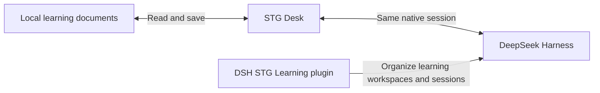

<div align="center">
  
  <h1>STG Desk</h1>
  <p><strong>Read lessons, write answers and chat with DSH in one learning workspace.</strong></p>
  <p>Windows portable build · Local Markdown · Native DSH session</p>
  <p>
    <a href="https://github.com/wildcat430524/STG-Desk/releases/latest"></a>
    
    <a href="LICENSE"></a>
  </p>
  <p>
    <strong><a href="https://github.com/wildcat430524/STG-Desk/releases/latest">Download for Windows</a></strong>
    · <a href="https://github.com/wildcat430524/dsh-stg-learning">Companion DSH plugin</a>
    · <a href="https://github.com/wildcat430524/STG-Desk/issues">Report an issue</a>
  </p>
  <p><a href="README.md">简体中文</a> | <strong>English</strong></p>
</div>

STG Desk is a Windows desktop app for the **StepsToGreat** learning directory. Open local Markdown documents directly, find the current lesson from the learning profile, read the teaching content, fill in answers, review evaluations, and then keep learning through the same native DSH session.

<p align="center">
  <a href="#interface-preview">Interface preview</a> ·
  <a href="#quick-start">Quick start</a> ·
  <a href="#main-features">Main features</a> ·
  <a href="#guide-one-learning-pass">Guide</a> ·
  <a href="#faq">FAQ</a> ·
  <a href="#development-build-and-verification">Development</a>
</p>

## Interface preview

Teaching content, the answer workspace and the DSH collaboration panel share one page. The top bar offers four page entries: teaching, answer, current chapter progress and overall progress.


<details>
<summary><strong>More interface: progress pages, detached document windows and the DSH mini window</strong></summary>

### Progress pages

Click 「当前章节进度」 ("Current chapter progress") or 「总体进度」 ("Overall progress") to view the learning records already present in the document. Progress pages can be opened at any time and do not offer a pop-out window feature.


### Detached document windows and the DSH mini window

After opening the teaching or answer page, click 「开窗口 ↗」 ("Open window ↗") inside the document. When teaching pops out, the main app automatically switches to the answer page and the teaching entry is temporarily disabled; after closing the detached window it switches back to teaching. The answer page works the same way, and an unsaved draft is carried back to the main app too.


<table>
  <tr><th>Teaching window</th><th>Student window</th></tr>
  <tr>
    <td valign="top"></td>
    <td valign="top"></td>
  </tr>
</table>

The DSH conversation can also switch to a rounded detached mini window that supports always-on-top, minimize and returning to the main window. Below is the interface before connecting.


</details>

Screenshots use the project demo lesson and test drafts; they contain no real learning records or model replies.

## Why this workbench

Learning material is usually scattered across teaching documents, student answers, learning profiles and AI conversations. STG Desk brings what you need right now together, so the learning process follows "read the lesson → write answers → review the evaluation → continue to the next round".

- **Open it and know where you are**: reads the current handoff state of the learning profile and shows the real lesson and document paths.
- **Answer right next to the teaching**: automatically associates the student document in the same directory, and appends answers under the matching question.
- **One answer workspace for daily work**: write this round's answers, review past rounds, and edit the full student document.
- **Arrange windows the way you like**: teaching and student documents each open independently, which suits split screens or multiple monitors.
- **Reuse DSH's conversation and models**: no need to copy content between two chat histories.

## Quick start

1. Download the Windows portable `.exe` from the [latest release page](https://github.com/wildcat430524/STG-Desk/releases/latest) (the asset is named `STG-Desk-<version>-Windows.exe`) and double-click it. The portable build needs no separate Node.js or Electron install.
2. Click 「导入学习文件夹」 ("Import learning folder"), or drag a folder from File Explorer into the window. Choose the workspace root that contains the learning profile and lesson directories.
3. The app reads this directory directly and does not copy learning material. Click 「继续学习」 ("Continue learning") to enter the current lesson, or open a published lesson through 「选择课程」 ("Choose lesson").
4. Read the teaching document, fill in this round's answers in the answer workspace, and click 「保存本轮作答」 ("Save this round's answers").
5. When you need an AI evaluation, open DSH and connect the same learning session, then send the prepared evaluation request.

The source tree includes a [demo workspace](demo/StepsToGreat), and you can also try it through the demo entry on the app's welcome page. The demo content is for getting familiar with the workflow and does not represent real mastery records.

<details>
<summary><strong>What a learning folder looks like</strong></summary>

The following is the structure of the project demo directory:

```text
StepsToGreat/
├─ README.md
└─ 我的学习/
   ├─ 00-学习档案.md
   └─ 学科/
      └─ Python/
         └─ 01-认识变量/
            ├─ 01_教学引导.md
            └─ 01_学生回答.md
```

Teaching and student documents use the same prefix and sit in the same directory, which makes automatic association easier. The current lesson comes from the handoff state in the learning profile; lessons and rounds follow the existing documents, and the app does not infer mastery on its own or generate the next lesson.

</details>

## Main features

| Module | What you can do |
| --- | --- |
| Learning navigation | Import or drag in a folder; restore the last workspace; find the current lesson from the profile; choose a published lesson |
| Document reading | Adjust font size, line spacing and width; view tables, code, formulas and workspace images; enter focus mode from the bottom controls |
| Document editing | Single-column visual editing: click text and type; untouched blocks retain their original Markdown |
| Student answers | Enter answers per question, insert code blocks, keep drafts automatically, append and save this round's original answers |
| Answer records | View past rounds' original answers, tutor evaluations and final re-evaluations, keeping unrecognized document sections |
| Full student document | Read, edit, save, handle conflicts and restore history directly in the answer workspace |
| Detached windows | Open teaching and student documents separately; they keep using the original documents after the main window switches lesson or closes |
| DSH collaboration | Connect to an already-open DSH; use the same session, live messages and model catalog; switch between side panel and mini window |
| Save protection | Version check before saving, backup before writing, external-change reminders, manual merge, cross-window write queue |

The interface uses a unified light-grey background, rounded cards, soft shadows and clear grey caption text. Hover, press and dialogs use gentle motion, and follow the system "reduce motion" setting.

## Guide: one learning pass

Follow "read the lesson → write answers → review the evaluation → continue to the next round". Expand an item below for the detailed steps.

<details>
<summary><strong>1. Read the teaching</strong></summary>

Teaching and answer documents both use one visual editing surface. Click headings, paragraphs, task items or table cells to edit directly while keeping their formatting. Paths, document information and actions sit at the bottom, leaving the centered document clear above. Font size, line spacing and width can be adjusted in the bottom reading settings.

The bottom "Night" switch changes the entire workspace, including navigation, documents, answers, DSH and dialogs; detached windows share the theme. The bottom "Focus" button hides the surrounding workspace. Its exit button remains available, and Escape also exits focus mode. Checking a task item updates the automatically preserved draft; click "Save" to write it to the document.

Saving preserves the original Markdown, comments and separators of untouched blocks, and serializes only edited blocks. Chinese input composition, native keyboard undo and redo, automatic drafts and version conflict protection remain available. Inline formulas can be edited by double-clicking; metadata and unsupported constructs retain their original source.


</details>

<details>
<summary><strong>2. Edit the answer document directly</strong></summary>

After clicking the answer document at the top, the original text goes straight into editing, with no mode options and no practice workspace. You can write answers under a question, change existing content or check tutor feedback, then click 「保存」 ("Save") or press `Ctrl+S` to write to the original document. The detached student window uses the same interface.

The teaching page still offers per-question answer entries on the right:

| Entry | Purpose | How it is saved |
| --- | --- | --- |
| 本轮作答 (this round's answers) | Fill in the questions of the latest published round, with support for explanations and code | Click 「保存本轮作答」 ("Save this round's answers") and the original answers are appended to the student document |
| 作答记录 (answer records) | View each round's answers, evaluations and final results in original order | Read the saved content |
| 完整文档 (full document) | Read and edit the whole student answer, including sections the per-question view does not cover | After entering edit mode click 「保存回答文档」 ("Save answer document"); the version is checked and a backup is made before writing |

Per-question answering supports question headings, bold question numbers and numbered lists in 「本轮题目」 ("this round's questions"); it distinguishes normal rounds from Feynman rounds, and supports per-question answering when the current round has 1–3 questions. For more than 3 questions or an unrecognized format, open the answer document at the top to edit it directly.

Input is automatically kept as a local draft, but a draft is not the same as writing to the official document. Submitting keeps the existing answers and evaluations, and does not automatically change the mastery table, handoff state, tutor evaluation or final re-evaluation.

After saving, the answer text appears under the matching question, so you can check what was written and then continue with the next question.


</details>

<details>
<summary><strong>3. Arrange your own desktop with detached windows</strong></summary>

- On the teaching or answer page, click 「开窗口 ↗」 ("Open window ↗") to open a detached window for that document.
- The main app automatically switches to the other document and the popped-out document's entry is temporarily disabled; progress pages remain available at any time.
- After closing the detached window, the main app automatically switches back to that document and restores the unsaved draft.
- After the main window switches lesson, switches learning folder or closes, detached document windows keep using the learning folder they were opened with.

Each window keeps its own draft. When several windows modify the same file, they share a write queue and version checks; on an external update you need to check the content to avoid overwriting other changes.

</details>

<details>
<summary><strong>4. Continue evaluation and discussion in DSH</strong></summary>

1. First open the **DeepSeek Harness desktop app**.
2. Open the DSH panel at the top right of STG Desk and click 「连接」 ("Connect").
3. On the first connection, STG Desk creates a dedicated session for the current learning folder in its corresponding DSH workspace, then restores that learning session on later connections. You can also explicitly select an existing session for this folder from the conversation menu, or create a new one.
4. Choose a model DSH can currently call and keep discussing. After saving this round's answers, you can send the prepared evaluation request in DSH.

The side panel and the DSH mini window share the same session, messages, model selection and input draft. The model list comes from DSH's native model catalog and includes the user's configured providers and plugin models; switching follows DSH's native behavior, including updating the default model and keeping the reasoning effort the target model supports.

The panel shows the learning folder's workspace path and clears the previous session display when you switch folders. After an upgrade, session bindings automatically created by older versions are re-established. Previous conversations remain in DSH history and can be selected manually from the current folder's session menu.

</details>

<details>
<summary><strong>Keyboard shortcuts</strong></summary>

| Shortcut | Action |
| --- | --- |
| `Ctrl+S` | Save the document currently being edited |
| `Ctrl+O` | Import a learning folder in the main window |
| `Ctrl++` / `Ctrl+-` | Zoom the interface in / out |
| `Ctrl+0` | Reset zoom to default |
| `F11` | Toggle full screen |

</details>

## How STG Desk, the learning plugin and DSH relate

| Project | What it handles | Is it required? |
| --- | --- | --- |
| **STG Desk** | Local teaching reading, student answers, document editing, backups and collaboration windows | Required to use this workbench |
| **[DSH STG Learning](https://github.com/wildcat430524/dsh-stg-learning)** | Learning workspace and session management inside DSH, lesson marking, pinning and the STG download entry | Optional; handy for organizing many sessions |
| **DeepSeek Harness** | Model configuration, native sessions and AI replies | Needs to be running to use collaboration chat |



STG Desk and the learning plugin are two independent open-source projects, installed, upgraded and uninstalled separately. The plugin does not bundle STG Desk and does not include DSH host source code; at the top of the plugin you can download STG Desk, then fill in the local exe path. Choose the same learning folder and DSH session on both sides to work together.

## Data storage and recovery

| Content | Location and behavior |
| --- | --- |
| Teaching documents, student answers, learning profile | Markdown files in the original learning directory |
| Document history backups | `.stg-desk/backups/` in the learning directory; 20 versions per document by default, configurable from 5 to 100 |
| Unsaved documents and unsubmitted answers | Local drafts in the system application-settings directory; detached windows use their own draft directories |
| Recently opened paths, reading settings | System application-settings directory |
| DSH sessions and model configuration | Managed by DSH; STG Desk connects to its existing service |

Before saving, the file version is checked, the old content is backed up, and the write goes through a temporary file replacement. External changes prompt you to reload or merge manually; restoring a history version also backs up the current content first.

<details>
<summary><strong>History window and restore</strong></summary>

The history window provides a backup list and a preview of the original text, so you can check before restoring the selected version.


</details>

Drafts are written after roughly 250 milliseconds of typing pause, and the app waits for the draft to save successfully before closing a window. A sudden power loss may lose the last input that has not yet been written. Restoring a draft does not automatically overwrite the official document; backups are stored locally and are not the same as cloud sync.

## FAQ

<details>
<summary><strong>Can I use it without DSH open?</strong></summary>

Yes, you can read, edit and answer questions. Sending AI messages requires the DSH desktop app to be running; when DSH closes, the conversation stops, but existing history is still readable.

</details>

<details>
<summary><strong>Do I have to install the learning plugin to connect to DSH?</strong></summary>

No. STG Desk's desktop-chat connection and the learning-management plugin are different features; the plugin is for organizing learning workspaces and sessions inside DSH.

</details>

<details>
<summary><strong>Can I only use models from the developer's computer?</strong></summary>

No. It connects to the DSH on the machine of the user running this software, and models come from that user's configuration and native model catalog. Actual calls depend on the account and quota the user configures in DSH.

</details>

<details>
<summary><strong>Why is there no current lesson or per-question answering?</strong></summary>

Check the imported directory, the document paths in the learning profile, the pairing of teaching and student documents, and whether the questions have been published. The student document can be opened for editing directly from the answer entry at the top.

</details>

<details>
<summary><strong>Why does it ask me to save the full document before submitting?</strong></summary>

The full document and the per-question input write to the same student file. Save the full-document edits first, then submit this round's answers, which avoids the two kinds of change overwriting each other.

</details>

<details>
<summary><strong>What if another program or my tutor changes the document?</strong></summary>

Keep your draft, reload and check. For a document conflict you can compare the two versions, merge manually and then save; do not directly overwrite an external update you have not checked.

</details>

<details>
<summary><strong>Are all document formats supported?</strong></summary>

It currently views and edits UTF-8 Markdown/TXT, up to 8 MB per file. Common UTF-8 BOM and CRLF are supported; PDF and DOCX are outside the current parsing scope, and Mermaid is kept as a code block inside the app.

</details>

<details>
<summary><strong>Why does Windows show a warning after downloading?</strong></summary>

Current distributions are not code-signed yet. Please get the software from this repository's Releases; the release page provides `SHA256SUMS.txt`, which you can use to verify the downloaded file.

</details>

<details>
<summary><strong>DSH connection configuration (custom port and config directory)</strong></summary>

The verified desktop version is **0.2.0-rc.2**, which does not mean all DSH versions are covered. It connects to local port `19387` by default. To use a custom port or config directory, set these before starting STG Desk:

```powershell
$env:STG_DSH_DESKTOP_URL = 'http://127.0.0.1:19387'
$env:DSH_HOME = 'C:\your-dsh-config-dir'
& 'C:\your-app-dir\STG-Desk-<version>-Windows.exe'
```

Replace `<version>` with the actual version of the downloaded file, and set only the items that actually change. The connection address is limited to local HTTP addresses; the app reads the desktop connection authorization only in the main process and does not copy model accounts or keys.

</details>

## Development, build and verification

Requires **Node.js 22.12+**; current verification and CI use Node.js 24. The Windows distribution uses Electron and electron-builder.

```powershell
git clone https://github.com/wildcat430524/STG-Desk.git
cd STG-Desk
npm ci
npm start
```

| Command | Purpose |
| --- | --- |
| `npm run dev` | Start the web interface preview; local file features need the desktop host |
| `npm test` | Run tests for data, files, protocol and save logic |
| `npm run test:desktop` | Build and run real Electron desktop acceptance |
| `npm run pack` | Produce a directory build; keep the whole `win-unpacked` directory at runtime |
| `npm run dist` | Produce the Windows portable exe, output to `release/` |

When developing the desktop interface, run `npm run dev` first, then in another terminal set `$env:STG_DEV_URL='http://127.0.0.1:5178'` and run `npx electron .`.

### Source layout

```text
electron/          Desktop windows, restricted IPC bridge, DSH panel and detached document windows
src/               Learning pages, answer workspace, editor and styles
lib/               Learning navigation, Markdown parsing, file saving, drafts and DSH connection
tests/             Automated tests
demo/              Demo lessons you can try
docs/screenshots/  README interface screenshots
.github/workflows/ Automated verification, Windows build and release
```

The project provides automated tests and real Electron desktop acceptance covering question and record display, full-document editing, draft recovery, external changes, backups and conflicts, plus continuing to answer in the detached student window after the main window closes. Desktop acceptance uses a temporary demo directory and does not write to real learning material. For CI status see [GitHub Actions](https://github.com/wildcat430524/STG-Desk/actions).

### Technology stack

| Technology | Purpose |
| --- | --- |
| Electron | Windows desktop host and native windows |
| CodeMirror 6 | Single-column live Markdown editing |
| markdown-it / KaTeX | Markdown, tables, task lists and formula rendering |
| DOMPurify | Sanitizes document output |
| chokidar | Watches learning files for changes |
| Vite / electron-builder | Interface build and software distribution |

Document rendering disables raw HTML, and the renderer process has no Node access; file access is limited to the imported directory. Hidden directories, symlinks and dependency/build directories are ignored; images inside the workspace can be loaded, while remote images are not loaded by default.

## Contributing

Issues and suggestions are welcome through [Issues](https://github.com/wildcat430524/STG-Desk/issues), or improve the interface, documentation and compatibility through a Pull Request. When reporting a problem, state the software version, DSH version, reproduction steps and expected behavior; a minimal, redacted Markdown example makes it easier to pin down.

For changes involving saving, backups, document parsing or window behavior, please run the relevant tests. For interface changes, attach screenshots with demo data and check narrow windows and the reduce-motion setting.

## License

New code in this project is under the [MIT](LICENSE) license. Third-party licenses are listed in [THIRD-PARTY-NOTICES.md](THIRD-PARTY-NOTICES.md) and in the LICENSE file of each installed dependency. Upstream full source code downloaded during the research stage, personal configuration and local test artifacts are not part of the application distribution.
