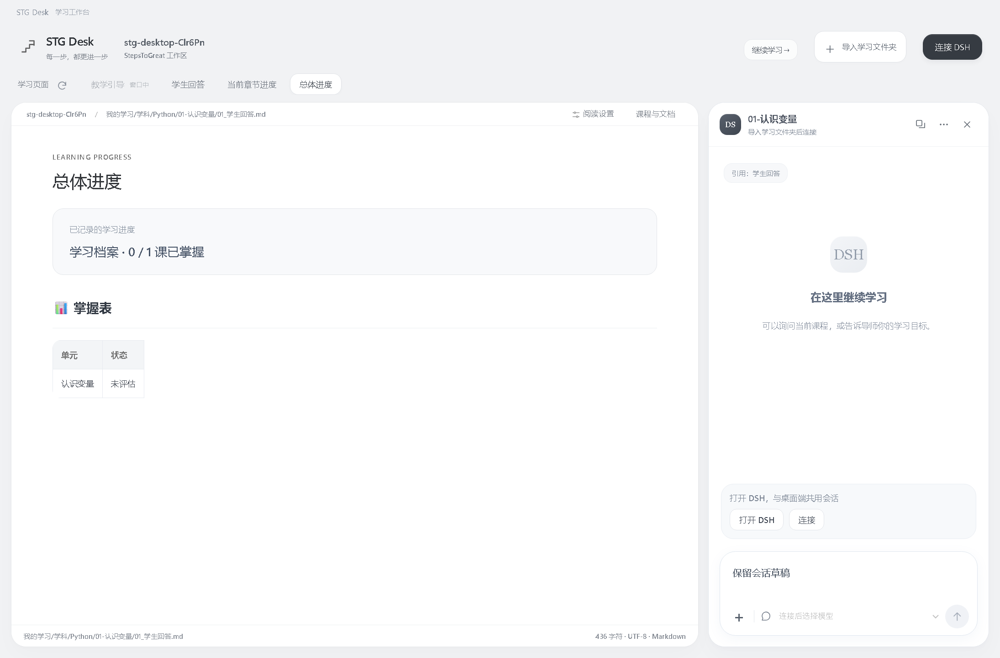
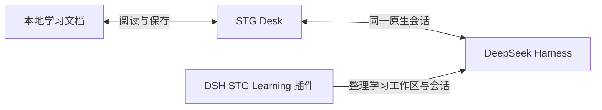

<div align="center">
  
  <h1>STG Desk</h1>
  <p><strong>把教学阅读、学生作答和 DSH 对话放进同一个学习工作台。</strong></p>
  <p>Windows 便携应用 · 本地 Markdown · 原生 DSH 会话</p>
  <p>
    <a href="https://github.com/wildcat430524/STG-Desk/releases/latest"></a>
    
    <a href="LICENSE"></a>
  </p>
  <p>
    <strong><a href="https://github.com/wildcat430524/STG-Desk/releases/latest">下载 Windows 便携版</a></strong>
    · <a href="https://github.com/wildcat430524/dsh-stg-learning">配套 DSH 插件</a>
    · <a href="https://github.com/wildcat430524/STG-Desk/issues">反馈问题</a>
  </p>
  <p><strong>简体中文</strong> | <a href="README.en.md">English</a></p>
</div>

STG Desk 是面向 **StepsToGreat** 学习目录的 Windows 桌面应用。直接打开本地 Markdown 文档，从学习档案找到当前课程，阅读教学内容、填写答案、查看评估，再通过 DSH 的同一原生会话继续学习。

<p align="center">
  <a href="#界面预览">界面预览</a> ·
  <a href="#快速开始">快速开始</a> ·
  <a href="#主要功能">主要功能</a> ·
  <a href="#使用指南">使用指南</a> ·
  <a href="#常见问题">常见问题</a> ·
  <a href="#开发构建与验证">开发与构建</a>
</p>

## 界面预览

教学内容、作答区和 DSH 协作面板放在同一个页面。顶部提供教学、回答、当前章节进度和总体进度四个页面入口。


<details>
<summary><strong>更多界面：学习进度、独立文档窗口与 DSH 小窗</strong></summary>

### 进度页面

点击「当前章节进度」或「总体进度」查看文档中已有的学习记录。进度页面随时可以进入，不提供开窗口功能。


### 独立文档窗口与 DSH 小窗

打开教学或回答页面后，点击文档内的「开窗口 ↗」。弹出教学时，主应用自动切到回答，教学入口暂时禁用；关闭独立窗口后自动切回教学。回答页面同理，未保存草稿也会带回主应用。



<table>
  <tr><th>教学窗口</th><th>学生窗口</th></tr>
  <tr>
    <td valign="top"></td>
    <td valign="top"></td>
  </tr>
</table>

DSH 对话也能切换到圆角独立小窗，支持置顶、最小化与回到主窗口。下面展示连接前的界面。


</details>

截图使用项目演示课程与测试草稿，不包含真实学习记录或模型回复。

## 为什么做这个工作台

学习资料通常分散在教学文档、学生回答、学习档案和 AI 对话里。STG Desk 把当前需要的内容集中起来，让学习过程顺着「读教学 → 写答案 → 看评估 → 继续下一轮」进行。

- **打开就知道学到哪**：读取学习档案的当前交接状态，展示真实课程与文档路径。
- **在教学旁边直接答题**：自动关联同目录学生文档，答案追加到对应题目下。
- **一个作答区完成日常操作**：写本轮答案、查看历轮记录、编辑完整学生文档。
- **按自己的习惯摆窗口**：教学与学生文档都能独立打开，适合分屏或多显示器。
- **沿用 DSH 的对话和模型**：无需在两套聊天记录之间复制内容。

## 快速开始

1. 在 [最新发布页](https://github.com/wildcat430524/STG-Desk/releases/latest) 下载 Windows 便携版 `.exe`，双击运行。便携版无需另装 Node.js 或 Electron。
2. 点击「导入学习文件夹」，或者把文件夹从资源管理器拖入窗口。请选择包含学习档案与课程目录的工作区根目录。
3. 软件会直接读取这个目录，不复制学习资料。点击「继续学习」进入当前课，或通过「选择课程」打开已发布课程。
4. 阅读教学文档，在作答区填写当前轮答案，点击「保存本轮作答」。
5. 需要 AI 评估时，打开 DSH 并连接同一个学习会话，再发送准备好的评估请求。

源码中提供了 [演示工作区](demo/StepsToGreat)，也可以通过应用欢迎页的演示入口体验。演示内容用于了解操作，不代表真实掌握记录。

<details>
<summary><strong>学习文件夹结构与文档配对规则</strong></summary>

以下是项目演示目录的结构：

```text
StepsToGreat/
├─ README.md
└─ 我的学习/
   ├─ 00-学习档案.md
   └─ 学科/
      └─ Python/
         └─ 01-认识变量/
            ├─ 01_教学引导.md
            └─ 01_学生回答.md
```

教学与学生文档使用相同前缀、放在同一目录，便于自动关联。当前课来自学习档案中的交接状态；课程与轮次以现有文档为准，软件不会自行推断掌握程度或生成下一课。

</details>

## 主要功能

| 模块 | 可以做什么 |
| --- | --- |
| 学习导航 | 导入或拖入文件夹；恢复上次工作区；从档案找到当前课；选择已发布课程 |
| 文档阅读 | 调整字号、行距和宽度；查看目录、表格、代码、公式和工作区内图片 |
| 文档编辑 | 单栏实时 Markdown 编辑、格式工具栏，原文直接保存 |
| 学生作答 | 按题输入答案、插入代码块、自动保留草稿、追加保存本轮原答 |
| 作答记录 | 查看历轮原答、导师评估和最终复评，保留未识别文档段落 |
| 完整学生文档 | 在作答区直接阅读、编辑、保存、处理冲突和恢复历史版本 |
| 独立窗口 | 分别打开教学与学生文档；主窗口切换课程或关闭后继续使用原文档 |
| DSH 协作 | 连接已打开的 DSH；使用同一会话、实时消息和模型目录；侧边面板与小窗切换 |
| 保存保护 | 保存前校验版本、写入前备份、外部修改提醒、手动合并、跨窗口写入队列 |

界面采用统一浅灰背景、圆角卡片、柔和阴影和清晰的灰色说明文字。悬停、按压和弹窗使用轻柔动效，并遵循系统「减少动态效果」设置。

## 使用指南

按「读教学 → 写答案 → 看评估 → 继续下一轮」完成学习。展开下面的说明查看具体操作。

<details>
<summary><strong>1. 阅读教学</strong></summary>

教学文档保留「阅读」和「编辑」两个模式。编辑时使用单栏实时排版：当前段落可直接输入 Markdown，其余段落显示排版结果，没有并排源码窗格。字号、行距和宽度可在阅读设置中调整。

顶部「夜间」开关切换整个工作台的配色，包含导航、阅读、编辑、作答、DSH 面板和弹窗；独立窗口会同步主题。阅读区另有明亮、纸张两种日间配色与专注模式，显示阅读位置、当前章节和预计阅读时长，目录会标出当前章节。代码块可一键复制，宽表格可横向滚动。清单显示完成计数和进度，点击顶部清单按钮可定位下一项未完成内容。勾选清单会自动保留为草稿，点击「保存」后才写入原文档。窗口较窄时，可通过「作答」按钮展开作答工作区。

编辑直接使用原始 Markdown，不对整份文档做格式转换；注释、公式、表格和任务清单都可保留。工具栏可插入标题、列表、引用、代码块和表格。


</details>

<details>
<summary><strong>2. 直接编辑回答文档</strong></summary>

点击顶部的回答文档后，原文直接进入编辑，没有模式选项和练习工作区。可以在题目下写答案、修改已有内容或核对导师反馈，点击「保存」或按 `Ctrl+S` 写入原文档。独立学生窗口使用相同界面。

教学页右侧仍提供按题作答入口：

| 入口 | 用途 | 保存方式 |
| --- | --- | --- |
| 本轮作答 | 填写最新已发布轮次的题目，支持理解说明与代码 | 点击「保存本轮作答」，原答追加到学生文档 |
| 作答记录 | 按原文顺序查看各轮答案、评估和最终结果 | 阅读已保存内容 |
| 完整文档 | 阅读和编辑整个学生回答，包括按题界面未覆盖的段落 | 进入编辑后点击「保存回答文档」，写入前校验版本并备份 |

按题作答支持问题标题、加粗题号及「本轮题目」中的编号列表，区分普通轮与费曼轮，当前轮有 1–3 题时支持按题作答；超过 3 题或格式暂时无法识别时，可打开顶部的回答文档直接编辑。

输入会自动保留本地草稿，但草稿不等于写入正式文档。提交保留原有答案与评估，不自动修改掌握表、交接状态、导师评估或最终复评。

保存后，答案原文出现在对应题目下，可以直接核对写入结果，再继续下一道题。


</details>

<details>
<summary><strong>3. 用独立窗口安排自己的桌面</strong></summary>

- 在教学或回答页面内点击「开窗口 ↗」，打开该文档的独立窗口。
- 主应用自动切到另一份文档，已弹出的文档入口暂时禁用；进度页面仍可随时进入。
- 关闭独立窗口后，主应用自动切回对应文档，并恢复未保存草稿。
- 主窗口切换课程、切换学习文件夹或关闭后，独立文档窗口仍使用打开时的学习文件夹。

各窗口保留独立草稿。多个窗口修改同一文件时，共享写入队列和版本校验；遇到外部更新时需核对内容，避免覆盖其他修改。

</details>

<details>
<summary><strong>4. 在 DSH 中继续评估与讨论</strong></summary>

1. 先打开 **DeepSeek Harness 桌面端**。
2. 在 STG Desk 右上打开 DSH 面板，点击「连接」。
3. 首次连接会为当前学习文件夹创建专用会话，并登记到 DSH 对应的工作区；之后自动恢复该学习会话。也可以在对话菜单中明确选择这个文件夹的已有会话，或新建会话。
4. 选择 DSH 当前可调用的模型，继续讨论。保存本轮作答后，可在 DSH 中发送准备好的评估请求。

侧边面板与 DSH 小窗共用同一会话、消息、模型选择和输入草稿。模型列表来自 DSH 的原生模型目录，包含用户配置的提供方与插件模型；切换遵循 DSH 原生行为，包括更新默认模型，并保留目标模型支持的推理强度。

面板会显示学习文件夹的工作区路径，切换文件夹时清空旧会话显示。升级后会重新建立旧版本自动关联的会话绑定；旧对话仍保留在 DSH 历史中，可从当前文件夹的会话菜单手动接入。

</details>

<details>
<summary><strong>快捷键</strong></summary>

| 快捷键 | 操作 |
| --- | --- |
| `Ctrl+S` | 保存当前编辑的文档 |
| `Ctrl+O` | 主窗口导入学习文件夹 |
| `Ctrl++` / `Ctrl+-` | 放大 / 缩小界面 |
| `Ctrl+0` | 恢复默认缩放 |
| `F11` | 切换全屏 |

</details>

## STG Desk、学习插件和 DSH 的关系

| 项目 | 负责什么 | 是否必须安装 |
| --- | --- | --- |
| **STG Desk** | 本地教学阅读、学生作答、文档编辑、备份与协作窗口 | 使用本工作台时需要 |
| **[DSH STG Learning](https://github.com/wildcat430524/dsh-stg-learning)** | DSH 内的学习工作区与会话管理、课程标记、置顶和 STG 下载入口 | 可选；会话较多时方便整理 |
| **DeepSeek Harness** | 模型配置、原生会话与 AI 回复 | 使用协作对话时需要打开 |



STG Desk 和学习插件是两个独立开源项目，分别安装、升级与卸载。插件不内置 STG Desk，也不包含 DSH 宿主源码；在插件顶部可以下载 STG Desk，然后填写本机 exe 路径。两边选择相同学习文件夹和 DSH 会话即可协作。

## 数据保存与恢复

| 内容 | 保存位置与行为 |
| --- | --- |
| 教学文档、学生答案、学习档案 | 原学习目录中的 Markdown 文件 |
| 文档历史备份 | 学习目录的 `.stg-desk/backups/`，默认每份文档 20 个版本，可设置为 5–100 个 |
| 未保存文档与未提交答案 | 系统应用设置目录中的本地草稿；独立窗口使用各自草稿目录 |
| 最近打开路径、阅读设置 | 系统应用设置目录 |
| DSH 会话与模型配置 | 由 DSH 管理；STG Desk 连接其现有服务 |

保存前会检查文件版本，写入前备份旧内容，再通过临时文件替换。外部修改会提示重新载入或手动合并；恢复历史版本前也会备份当前内容。

<details>
<summary><strong>查看历史版本与恢复界面</strong></summary>

历史版本窗口提供备份列表和原文预览，核对后再恢复所选版本。


</details>

输入停顿约 250 毫秒后写入草稿，关闭窗口前等待草稿保存成功。突发断电可能丢失最后尚未写入的输入。恢复草稿不会自动覆盖正式文档；备份保存在本地，不等于云端同步。

## 常见问题

<details>
<summary><strong>没有打开 DSH，也能用吗？</strong></summary>

可以阅读、编辑和答题。发送 AI 消息需要 DSH 桌面端正在运行；DSH 关闭后停止对话，已有历史仍可阅读。

</details>

<details>
<summary><strong>必须安装学习插件才能连接 DSH 吗？</strong></summary>

不需要。STG Desk 的桌面对话连接与学习管理插件是不同功能，插件用于在 DSH 内整理学习工作区与会话。

</details>

<details>
<summary><strong>只能用开发者电脑上的模型吗？</strong></summary>

不是。连接的是运行这份软件的用户本机 DSH，模型来自该用户的配置与原生模型目录。实际调用取决于用户在 DSH 中配置的账号和额度。

</details>

<details>
<summary><strong>为什么没有当前课或按题作答？</strong></summary>

检查导入目录、学习档案里的文档路径、教学与学生文档的配对，以及题目是否已发布。学生文档可以直接从顶部回答入口打开编辑。

</details>

<details>
<summary><strong>为什么提交前提示先保存完整文档？</strong></summary>

完整文档与按题输入会写入同一学生文件。先保存完整文档编辑，再提交本轮答案，可避免两种修改互相覆盖。

</details>

<details>
<summary><strong>其他程序或导师改了文档怎么办？</strong></summary>

保留草稿，重新载入并核对。文档冲突可以对照两份内容、手动合并后保存；不要直接覆盖未核对的外部更新。

</details>

<details>
<summary><strong>支持所有文档格式吗？</strong></summary>

当前查看和编辑 UTF-8 Markdown/TXT，单个文件不超过 8 MB。支持常见 UTF-8 BOM 与 CRLF；PDF、DOCX 不在当前解析范围，Mermaid 在应用内保留为代码块。

</details>

<details>
<summary><strong>下载后为什么有 Windows 提示？</strong></summary>

当前分发尚未代码签名。请从本仓库 Releases 获取软件，发布页提供 `SHA256SUMS.txt`，可用于核对下载文件。

</details>

<details>
<summary><strong>DSH 连接配置（自定义端口与配置目录）</strong></summary>

已验证的桌面版本为 **0.2.0-rc.2**，不代表覆盖所有 DSH 版本。默认连接本机端口 `19387`。自定义端口或配置目录时，在启动 STG Desk 前设置：

```powershell
$env:STG_DSH_DESKTOP_URL = 'http://127.0.0.1:19387'
$env:DSH_HOME = 'C:\你的DSH配置目录'
& 'C:\你的软件目录\STG-Desk-<版本号>-Windows.exe'
```

将 `<版本号>` 替换为下载文件的实际版本，只需设置实际有变化的项。连接地址限制为本机 HTTP 地址；应用只在主进程读取桌面连接授权，不复制模型账号或密钥。

</details>

## 开发、构建与验证

需要 **Node.js 22.12+**；当前验证和 CI 使用 Node.js 24。Windows 分发使用 Electron 和 electron-builder。

```powershell
git clone https://github.com/wildcat430524/STG-Desk.git
cd STG-Desk
npm ci
npm start
```

| 命令 | 用途 |
| --- | --- |
| `npm run dev` | 启动网页界面预览，本地文件功能需桌面宿主 |
| `npm test` | 运行数据、文件、协议与保存逻辑测试 |
| `npm run test:desktop` | 构建并执行真实 Electron 桌面验收 |
| `npm run pack` | 生成目录版；运行时保留整个 `win-unpacked` 目录 |
| `npm run dist` | 生成 Windows 便携 exe，输出到 `release/` |

开发桌面界面时，先运行 `npm run dev`，再在另一终端设置 `$env:STG_DEV_URL='http://127.0.0.1:5178'` 并执行 `npx electron .`。

### 源码结构

```text
electron/          桌面窗口、受限 IPC 桥、DSH 面板与独立文档窗口
src/               学习页面、作答区、编辑器与样式
lib/               学习导航、Markdown 解析、文件保存、草稿与 DSH 连接
tests/             自动测试
demo/              可体验的演示课程
docs/screenshots/  README 界面截图
.github/workflows/ 自动验证、Windows 构建与发布
```

项目提供自动测试与真实 Electron 桌面验收，覆盖题目与记录展示、完整文档编辑、草稿恢复、外部修改、备份与冲突，以及主窗口关闭后在独立学生窗口继续答题。桌面验收使用临时演示目录，不写入真实学习资料。CI 状态见 [GitHub Actions](https://github.com/wildcat430524/STG-Desk/actions)。

### 技术组成

| 技术 | 用途 |
| --- | --- |
| Electron | Windows 桌面宿主与原生窗口 |
| CodeMirror 6 | 单栏实时 Markdown 编辑 |
| markdown-it / KaTeX | Markdown、表格、任务清单与公式展示 |
| DOMPurify | 净化文档输出 |
| chokidar | 监测学习文件变化 |
| Vite / electron-builder | 界面构建与软件分发 |

文档渲染关闭原始 HTML，渲染进程无 Node 访问权限；文件访问限制在导入目录内。忽略隐藏目录、符号链接和依赖/构建目录；工作区内图片可加载，远程图片默认不加载。

## 参与贡献

欢迎通过 [Issues](https://github.com/wildcat430524/STG-Desk/issues) 提交使用问题与建议，或通过 Pull Request 改进界面、文档与兼容性。报告问题时说明软件版本、DSH 版本、复现步骤和预期行为；提供脱敏后的最小 Markdown 示例会更容易定位。

涉及保存、备份、文档解析或窗口行为的修改，请运行相关测试。界面修改请附演示数据截图，并检查窄窗口与减少动态效果设置。

## 许可证

本项目新增代码采用 [MIT](LICENSE)。第三方许可见 [THIRD-PARTY-NOTICES.md](THIRD-PARTY-NOTICES.md) 和所安装依赖各自的 LICENSE。研究阶段下载的上游完整源码、个人配置和本机测试产物不进入应用分发。
