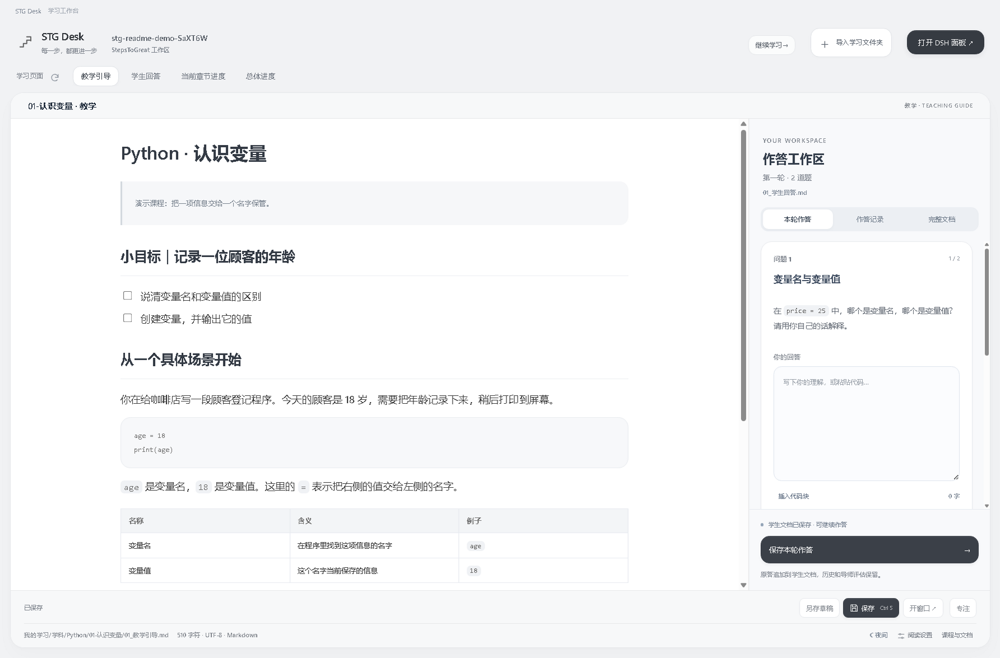
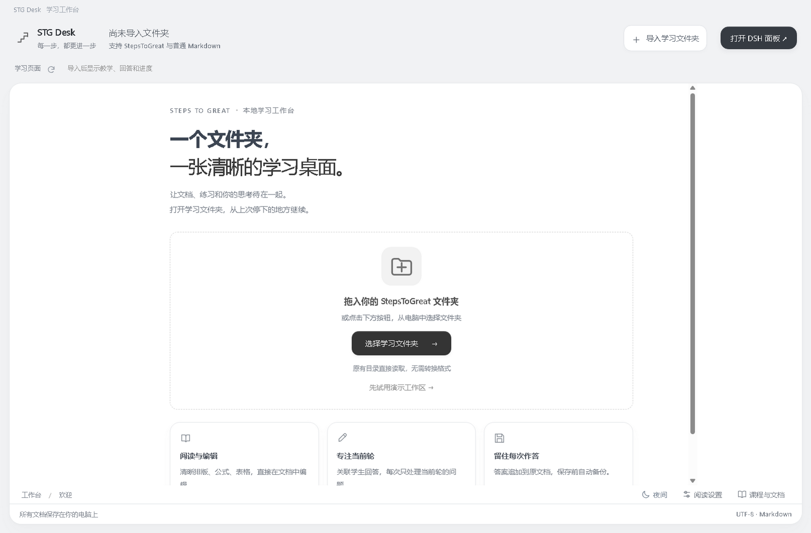
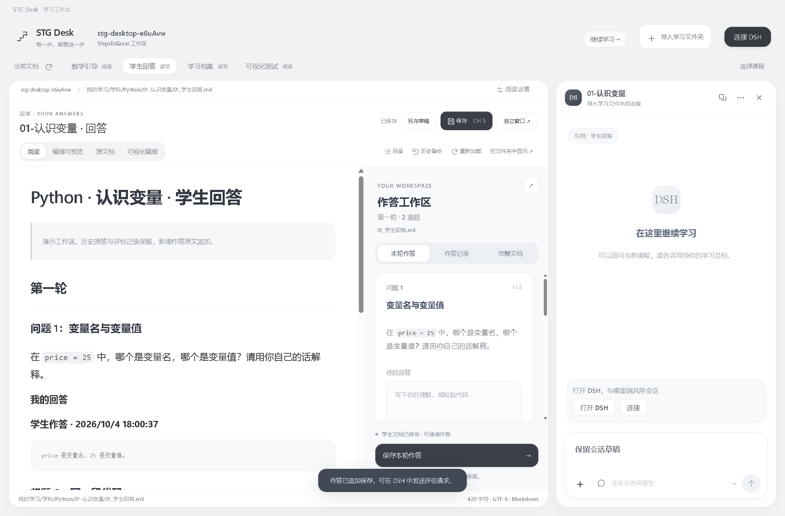
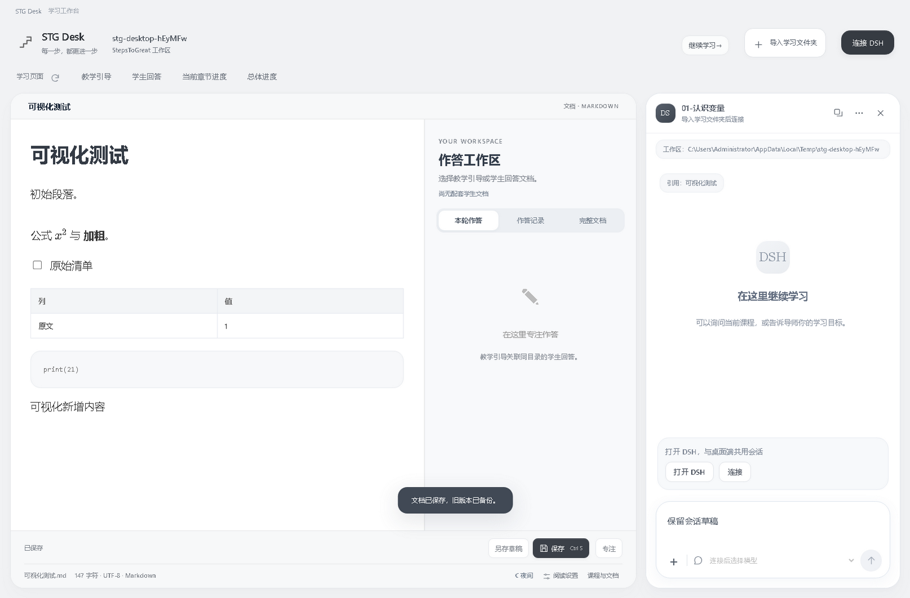
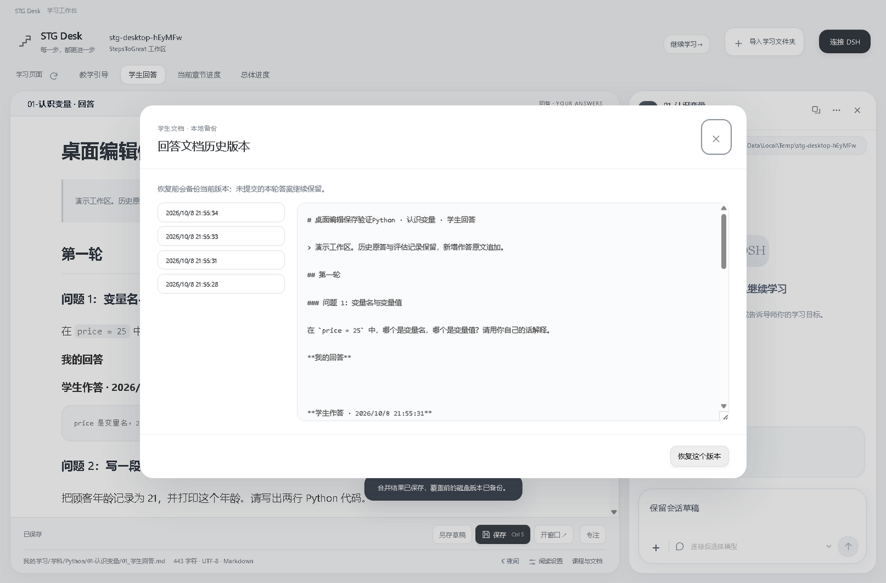
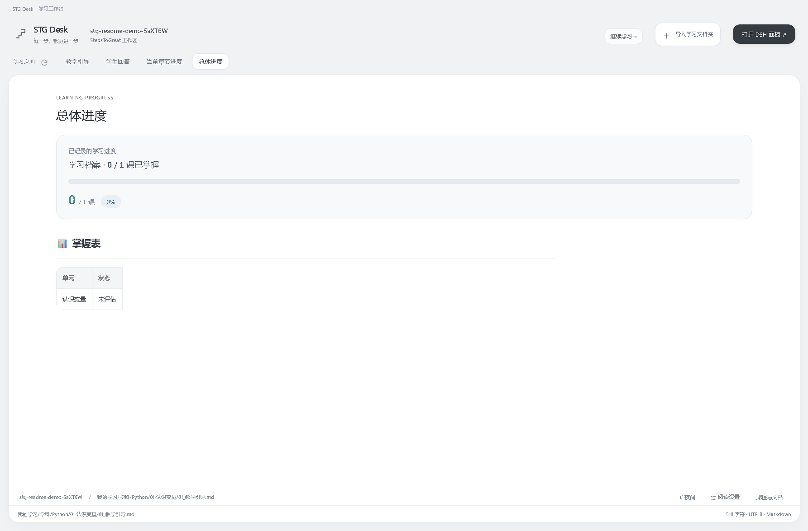
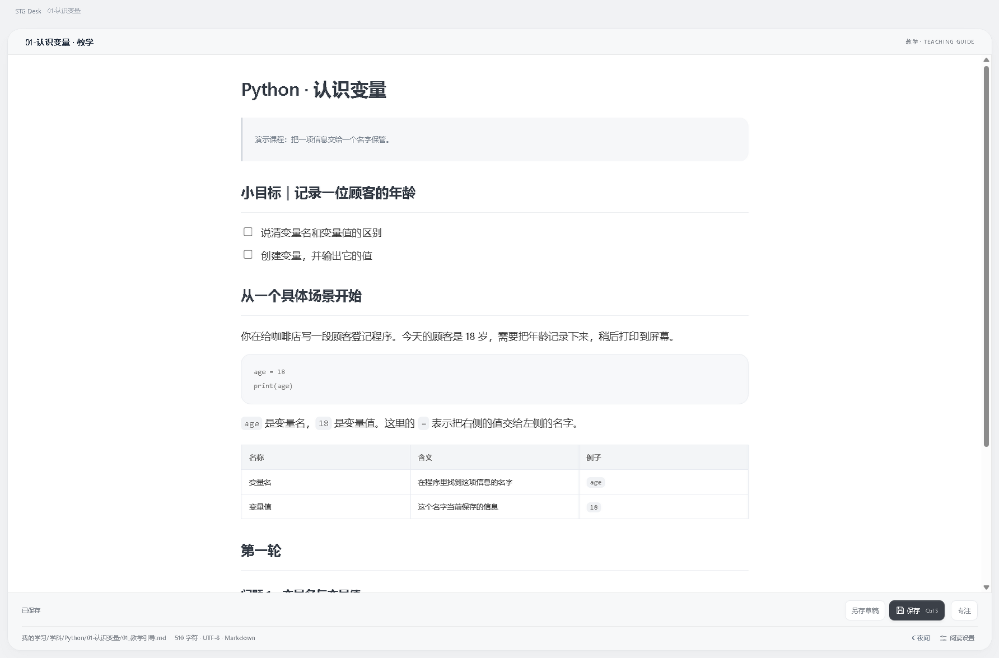
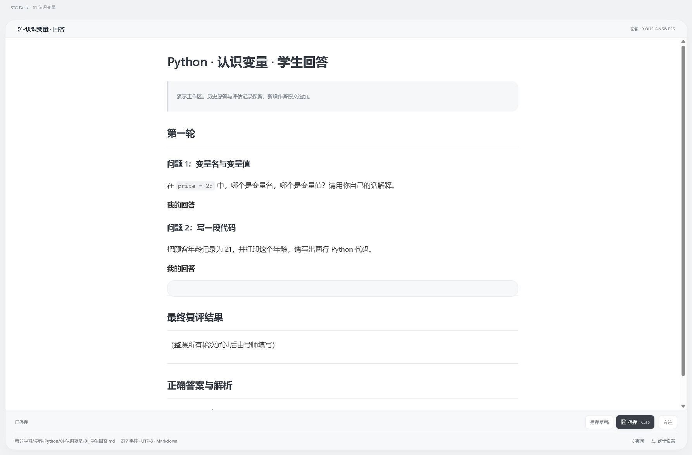
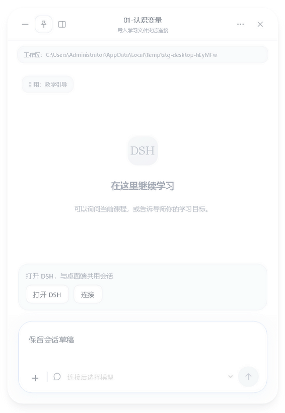

<div align="center">
  
  <h1>STG Desk</h1>
  <p><strong>读教学、写答案、看进度，在一个工作台里继续学习。</strong></p>
  <p>Windows 便携应用 · 本地 Markdown · DeepSeek Harness 协作</p>
  <p>
    <a href="https://github.com/wildcat430524/STG-Desk/releases/latest"></a>
    
    <a href="LICENSE"></a>
  </p>
  <p>
    <strong><a href="https://github.com/wildcat430524/STG-Desk/releases/latest">下载 Windows 便携版</a></strong>
    · <a href="#快速开始">快速开始</a>
    · <a href="https://github.com/wildcat430524/STG-Desk/issues">反馈问题</a>
  </p>
  <p><strong>简体中文</strong> | <a href="README.en.md">English</a></p>
</div>

STG Desk 是面向 [StepsToGreat](https://github.com/wildcat430524/StepsToGreat) 学习目录的 Windows 桌面工作台。打开本地学习文件夹，就能从档案找到当前课程，在教学旁写答案，查看历轮反馈与学习进度。需要 AI 评估或讨论时，可连接本机 **DeepSeek Harness（DSH）**，继续使用原生学习会话。

阅读、编辑和作答可以独立使用，DSH 对话按需连接。学习资料仍保存在原目录中，便于导师或学习 Agent 接着读取和更新。

> 本文介绍当前源码的功能。便携版以 [发布说明](https://github.com/wildcat430524/STG-Desk/releases) 为准，源码更新可能尚未进入最新下载版。应用界面目前为中文。

## 界面预览

教学、学生回答、当前章节进度和总体进度各有入口；教学与回答文档可以移到独立窗口，DSH 支持侧边面板与独立小窗。

<br>
<sub><strong>学习工作台。</strong>左边读教学，右边按题作答；需要评估或讨论时，从右上角展开 DSH 面板。</sub>

<table>
<tr>
<td width="50%"><br><sub><strong>欢迎页。</strong>导入学习文件夹，或先试用内置演示工作区；最近打开的目录会列在下方。</sub></td>
<td width="50%"><br><sub><strong>保存本轮作答。</strong>答案按原答追加进学生文档，旧版本自动备份，接着就能在 DSH 里发评估请求。</sub></td>
</tr>
<tr>
<td width="50%"><br><sub><strong>所见即所得编辑。</strong>就地改标题、清单、表格、公式与代码；没动过的区块保留原始 Markdown。</sub></td>
<td width="50%"><br><sub><strong>历史版本。</strong>每份文档保留近期备份，可先预览原文，再决定恢复哪一个版本。</sub></td>
</tr>
<tr>
<td width="50%"><br><sub><strong>总体进度。</strong>从学习档案读出已掌握单元、章节进度与交接状态，不额外维护一份数据。</sub></td>
<td width="50%"><br><sub><strong>独立教学窗口。</strong>把教学文档移到独立窗口，与作答区并排看；两边各自保留阅读位置。</sub></td>
</tr>
<tr>
<td width="50%"><br><sub><strong>独立回答窗口。</strong>回答文档同样可以开窗，主窗口切换课程后仍使用原工作区继续作答。</sub></td>
<td width="50%"><br><sub><strong>DSH 独立小窗。</strong>面板与小窗共用同一会话、模型和输入草稿，可置顶悬浮随时提问。</sub></td>
</tr>
</table>

截图使用演示课程与测试草稿，不包含真实学习记录或模型回复；界面目前为中文。

## 功能特性

- **接着上次学**：恢复最近工作区，从学习档案定位当前课，也可选择已有课程。
- **直接编辑文档**：单栏所见即所得，支持代码、表格、清单、公式和本地图片；未修改区块保留原始 Markdown。
- **教学旁边作答**：按题填写当前轮答案、插入代码块并追加保存；历轮原答、评估和复评可以随时核对。
- **完整文档随时修改**：回答页直接编辑全文，也能在教学旁查看与修改完整学生文档。
- **进度有据可查**：读取文档中的章节进度、总体进度、交接状态和掌握记录。
- **按自己的习惯阅读**：独立教学与回答窗口、字号与行距设置、阅读宽度、夜间主题和专注模式。
- **沿用 DSH 会话**：实时消息与模型选择来自本机 DSH；面板和小窗共用同一对话与输入草稿。
- **保存可以回头核对**：自动草稿、写入前备份、版本校验、外部修改提醒、手动合并与历史恢复。

软件展示已有学习记录，掌握判断、导师评估与下一课由导师或学习 Agent 更新。

## 快速开始

1. 从 [最新发布页](https://github.com/wildcat430524/STG-Desk/releases/latest) 下载 `STG-Desk-<版本号>-Windows.exe`，双击运行，无需另装 Node.js 或 Electron。
2. 点击「导入学习文件夹」，或从资源管理器把文件夹拖入窗口。选择包含学习档案和课程目录的工作区根目录。
3. 点击「继续学习」进入当前课，或通过「选择课程」打开已有课程。
4. 阅读教学，在旁边填写答案并「保存本轮作答」；也可打开回答页直接编辑，点击「保存」或按 `Ctrl+S` 写入文档。
5. 需要 AI 评估时，启动 DSH 桌面端，在 STG Desk 中打开 DSH 面板并连接，再发送评估请求。

暂时没有学习资料，可以从欢迎页体验 [内置演示课程](demo/StepsToGreat)。导入目录会直接读取原文件；保存时写入原学习目录，不复制成另一套资料。

<details>
<summary><strong>学习目录与文档配对</strong></summary>

演示目录采用以下结构：

```text
StepsToGreat/
├─ README.md
└─ 我的学习/
   ├─ 00-学习档案.md
   └─ 学科/
      └─ Python/
         └─ 01-认识变量/
            ├─ 01_教学引导.md
            └─ 01_学生回答.md
```

教学与学生文档放在同一目录并使用相同前缀，便于自动关联。当前课来自学习档案的交接状态；找不到课程时，请检查导入的根目录、档案里的文档路径和文档配对。

</details>

## 使用指南

### 阅读与作答

点击文档的标题、正文、清单或表格直接编辑；行内公式可双击修改。文档信息与操作集中在底部，可调整阅读设置、切换夜间主题或进入「专注」。按 `Esc` 或点击退出入口返回普通布局。

教学旁的作答区提供三个入口：

| 入口 | 用途 |
| --- | --- |
| 本轮作答 | 填写最新已发布轮次的题目，保存时追加原答 |
| 作答记录 | 查看历轮答案、导师评估与最终复评 |
| 完整文档 | 阅读和编辑整个学生回答，包括按题界面未覆盖的内容 |

按题输入支持普通轮与费曼轮，适用于当前轮有 1–3 道可识别题目的文档；题目更多或格式无法识别时，可直接编辑回答全文。全文有未保存修改时，先保存完整文档，再提交按题答案。

**自动草稿用于恢复输入，正式文档仍需点击保存。** 本轮提交会保留已有答案与评估，不自动修改掌握表或交接状态。

### 独立窗口

在教学或回答页点击「开窗口 ↗」，主应用切到另一份文档，已弹出的入口暂时禁用；进度页仍可进入。关闭独立窗口后，主应用回到对应文档并恢复草稿。

主窗口切换课程、切换学习目录或关闭后，独立窗口继续使用打开时的文档与工作区。各窗口保留独立草稿，写入同一文件时共享保存队列并校验版本。

### DSH 协作

先打开 **DeepSeek Harness 桌面端**并配置可用模型，保持其主窗口打开，再在 STG Desk 中打开 DSH 面板，点击「连接」。仅有后台进程运行时无法连接。首次连接会为当前学习目录创建专用会话，之后恢复该会话；也可选择这个目录的已有会话或新建会话。应用启动时默认不展开 DSH。

模型目录、账号和额度由你本机的 DSH 管理。保存答案后，再发送评估请求，让学习 Agent 读取文档进行评估。

[dsh-stg-learning](https://github.com/wildcat430524/dsh-stg-learning) 是独立的 DSH 学习管理插件，用于在 DSH 内组织工作区与会话；连接 DSH 无需安装该插件。

<details>
<summary><strong>DSH 版本与连接配置</strong></summary>

已验证的 DSH 桌面版本为 **0.2.0-rc.2**，默认连接地址为 `http://127.0.0.1:19387`。如本机使用不同端口或配置目录，在启动 STG Desk 前设置实际需要修改的项：

```powershell
$env:STG_DSH_DESKTOP_URL = 'http://127.0.0.1:19387'
$env:DSH_HOME = 'C:\你的DSH配置目录'
& 'C:\你的软件目录\STG-Desk-<版本号>-Windows.exe'
```

连接地址仅允许本机 HTTP 地址。桌面连接授权在主进程中读取，应用不复制模型账号或密钥。其他 DSH 版本的兼容性需要实际验证。

</details>

## 数据与恢复

| 数据 | 保存位置 |
| --- | --- |
| 教学、学生回答与学习档案 | 原学习目录中的 Markdown 文件 |
| 历史备份 | 学习目录的 `.stg-desk/backups/`，默认每份文档 20 个版本，可设为 5–100 个 |
| 未保存文档与按题答案草稿 | 系统应用设置目录；独立窗口有各自的草稿目录 |
| 最近工作区与阅读设置 | 系统应用设置目录 |
| DSH 会话与模型配置 | 由 DSH 管理 |

保存前校验文件版本，备份旧内容，再通过临时文件替换。外部修改会提示重新载入或手动合并；恢复历史版本前也会备份当前内容。

输入停顿约 250 毫秒后写入草稿；草稿恢复不会自动覆盖原文件。本地备份不等于云端同步，重要学习资料建议另行备份。

## 常见问题

<details>
<summary><strong>没有 DSH 可以使用吗？</strong></summary>

可以阅读、编辑和答题。发送 AI 消息需要本机 DSH 桌面端运行并有可用模型配置；关闭 DSH 后，已加载的历史仍可阅读。

</details>

<details>
<summary><strong>支持哪些文件格式？</strong></summary>

当前支持 UTF-8 Markdown/TXT，单文件上限 8 MB，支持 UTF-8 BOM 与 CRLF。PDF、DOCX 不在解析范围，Mermaid 保留为代码块。工作区内图片可以加载，远程图片默认不加载。

</details>

<details>
<summary><strong>下载后为什么有 Windows 提示？</strong></summary>

当前便携版尚未代码签名。请从本仓库 Releases 下载，可用发布页的 `SHA256SUMS.txt` 核对文件。

</details>

## 开发与构建

需要 **Node.js 22.12+**；CI 使用 Node.js 24。完整桌面功能需要 Electron 宿主。

```powershell
git clone https://github.com/wildcat430524/STG-Desk.git
cd STG-Desk
npm ci
npm start
```

| 命令 | 用途 |
| --- | --- |
| `npm run dev` | 启动 Vite 界面预览，浏览器中不提供完整桌面文件功能 |
| `npm run build` | 构建前端到 `dist/` |
| `npm test` | 运行解析、导航、文件保存、草稿与 DSH 协议等测试 |
| `npm run test:desktop` | 构建并运行 Electron 桌面冒烟验收 |
| `npm run pack` | 生成 Windows 目录版，使用时保留整个 `release/win-unpacked/` |
| `npm run dist` | 生成 `release/STG-Desk-<版本号>-Windows.exe` |

开发桌面界面时，先运行 `npm run dev`，再在另一终端设置 `$env:STG_DEV_URL='http://127.0.0.1:5178'` 并执行 `npx electron .`。

> 桌面冒烟验收需要在未被 `ELECTRON_RUN_AS_NODE=1` 污染的环境中运行；若出现 `app.setPath is not a function`，先清除该变量再重试。验收会在 `tests/artifacts/` 留下界面截图与 `desktop-smoke.json`。

<details>
<summary><strong>源码结构与技术组成</strong></summary>

```text
electron/          桌面窗口、IPC、DSH 控制与独立文档窗口
src/               学习页面、作答区、编辑器与样式
lib/               导航、文档解析、文件保存、草稿与 DSH 服务
tests/             逻辑测试与桌面验收
demo/              演示课程
docs/screenshots/  README 界面截图
.github/workflows/ Windows 验证、构建与发布
```

所见即所得编辑器使用 **Tiptap / ProseMirror**，文档展示使用 markdown-it / KaTeX，输出由 DOMPurify 净化；chokidar 监测文件变化，Vite / electron-builder 负责构建与分发。

文档渲染关闭原始 HTML，渲染进程无 Node 访问权限；文件访问限制在导入目录内，忽略隐藏目录、符号链接和依赖/构建目录。

CI 在 Windows 上执行依赖安装、逻辑测试和便携版构建；桌面冒烟验收可在本地运行。构建状态见 [GitHub Actions](https://github.com/wildcat430524/STG-Desk/actions)。

</details>

## 参与贡献

欢迎提交 [Issue](https://github.com/wildcat430524/STG-Desk/issues) 或 Pull Request。反馈时请提供软件版本、DSH 版本（如相关）、复现步骤和预期行为；文档解析问题可附脱敏的最小 Markdown 示例。

涉及保存、备份、解析或窗口行为的修改，请运行相关测试。界面修改请附演示数据截图，并检查窄窗口与系统「减少动态效果」设置。

## 许可证

本项目新增代码采用 [MIT](LICENSE)。第三方许可见 [THIRD-PARTY-NOTICES.md](THIRD-PARTY-NOTICES.md) 和依赖各自的 LICENSE。
